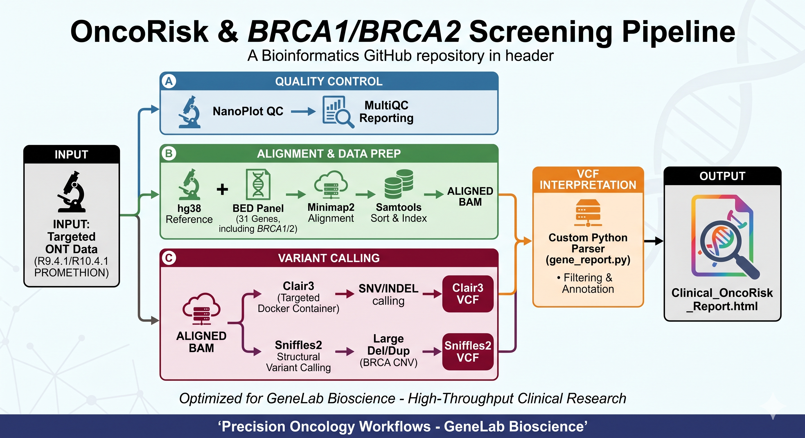

# OncoRisk & BRCA1/BRCA2 Screening Pipeline
## Facility: GeneLab Bioscience | Precision Oncology Hub

### 🧬 Overview
This repository contains a full-length, production-grade clinical pipeline for deep-sequencing target panels (e.g., 31-Gene OncoRisk Panel) using Oxford Nanopore Technologies (ONT). It is engineered to detect high-confidence Single Nucleotide Variants (SNVs), Small Indels, and Copy Number Variants/Large Structural Rearrangements in critical loci including **BRCA1** and **BRCA2**.

### 🚀 Key Pipeline Features
* **Quality Control Integration:** Comprehensive evaluation of raw long-read diagnostics using `NanoPlot`.
* **Full-Length Clair3 Pipeline:** Native shell execution of standard `Clair3` via Docker, restricting analysis to target regions via a `.bed` definition file to maximize computational speed and depth of coverage.
* **Structural Variant Analysis:** Integrated `Sniffles2` scanning to verify large-scale exon deletions or duplications typical of hereditary breast and ovarian cancer syndromes.
* **Clinical Report Automation:** A custom integrated Python parser that reads the processed VCF and compiles an interactive, laboratory-ready `Clinical_Onco_Report.html` dashboard.

### 🛠️ Core Tool Stack
* **QC:** `NanoPlot`
* **Alignment:** `Minimap2` & `Samtools`
* **Variant Variant Calling:** `Clair3` (Targeted Bed Mode)
* **Structural Variants:** `Sniffles2`
* **Interpretation & Reporting:** Python 3 Ecosystem
